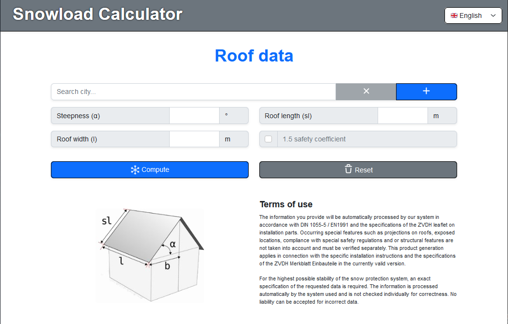
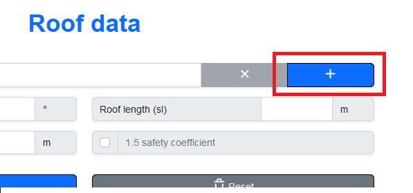
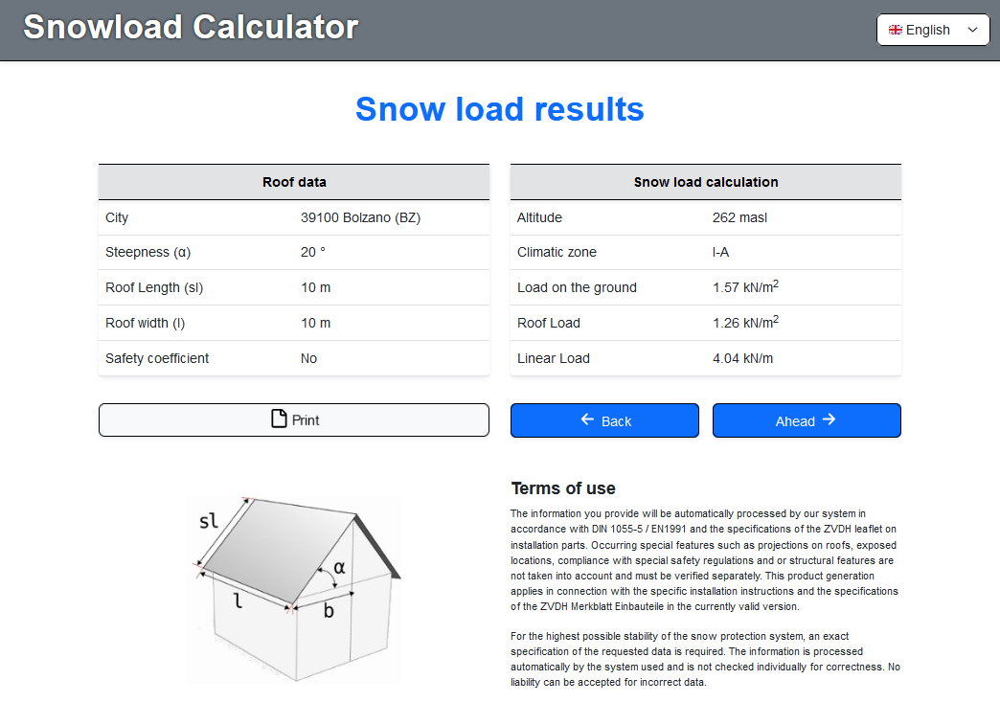
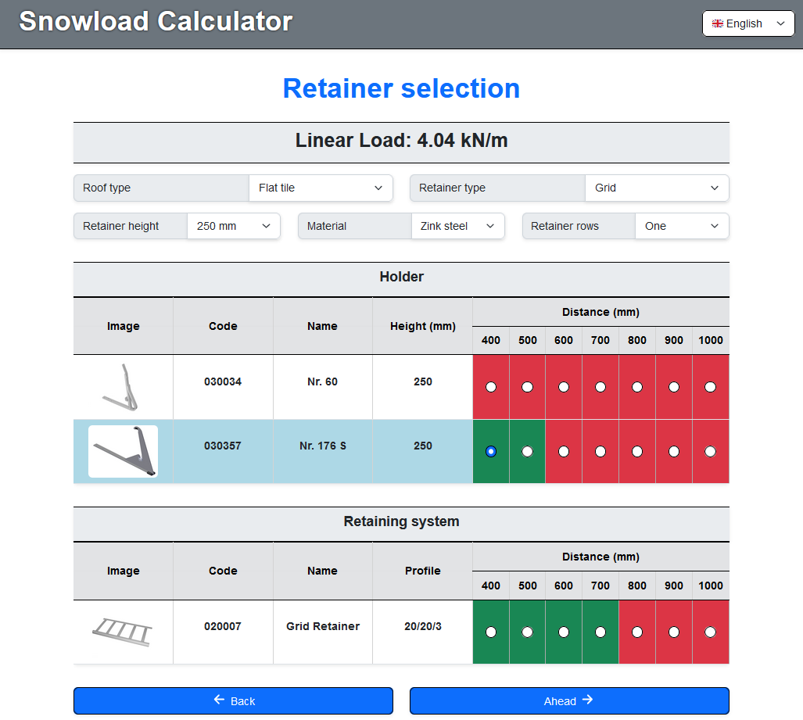
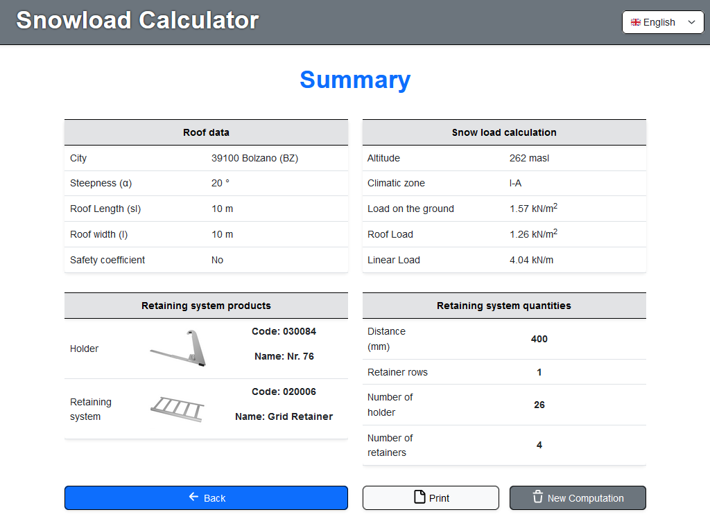
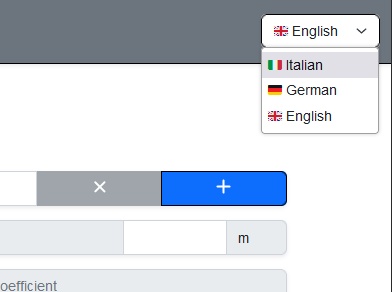

# Snowload Calculator
A web application for the calculation of snowload and snow retaining systems in Italy
based on the full stack application template from tutorial [app](https://www.baeldung.com/spring-boot-react-crud).
The application architecture is based on a backend API with `Java Spring Boot` along with a `MySql` database,
and a frontend application with `React`.

# Table of contents
* [How to configure](#how-to-configure)
  * [Back-end application](#back-end-application)
  * [Front-end application](#front-end-application)
* [How to use Snowload Calculator](#how-to-use-snowload-calculator)
* [Application demo](#application-demo)
* [Acknowledgements](#acknowledgements)
* [Author](#author)

# How to configure

## Back-end application

### Application Prerequisites

* Java 1.8 or higher.
* Maven
* Docker

### How to run

* Run `docker-compose up -d` to run the mysql database.
* The configuration should load all the queries found in `backend/sql/Init.sql` automatically the first time the docker container is created, if this is not the case you might need to run all of them manually.

To start the Spring Boot API, from the `backend/` folder run:

> mvn spring-boot:run

Access the API on http://localhost:8080/cities.
A complete list of the endpoints can be found in the [ENDPOINTS](ENDPOINTS.md) readme file.

As an alternative you can use `Docker` to run the dockerized version of `Spring Boot` with
`MySql`, by uncommenting the backend service in the `docker-comose.yaml` file:

```yaml
    #  backend:
    #    depends_on:
    #      - db
    #    restart: on-failure
    #    build: ./backend
    #    ports:
    #      - "8080:8080"
    ...
```

## Front-end application

### Application Prerequisites

* Node.js 12 or higher

### How to run

* From inside the `frontend/` folder run `npm install` to install the required packages
* To start the frontend application, from inside the `frontend/` folder run:

> npm start

Access the application at http://localhost:3000 in the browser.

As an alternative you can use the dockerized version of `Node` by uncommenting the backend service in the `docker-comose.yaml` file:

```yaml
    #  frontend:
    #    depends_on:
    #      - backend
    #    restart: on-failure
    #    build: ./frontend
    #    volumes:
    #      - ./frontend:/usr/app
    #    ports:
    #      - "3000:3000"
    ...
```
Please note that if you are using both the docker version of the `backend` and the `frontend` application, you need to change the `"proxy"` property 
in the `package.json` file of the `frontend` application from `http://localhost:8080` to `http://backend:8080`.

### How to test

* From inside the `frontend/` folder run `npm test` to run all the tests

# How to use Snowload Calculator

`Snowload Calculator` is a single page web application for the computation of
snow load and snow retaining systems in Italy.
The following is an overview on the different steps that need to 
be performed in order to use the application:

## Roof data

In the first page you have to select an italian city in the search field, and
provide the measures of the roof, namely the example steepness the roof lenght and the 
roof with.
The safety coefficient needs to be selected only if there
is another roof located under the one for which we are performing
the computation.

If the city is not listed i the list of cities, it is possible to add 
a new city with the `+` button on the right side of the search field:



## Snow load results

After clicking the button `Compute` in teh previous page,
we are presented with the first results of the snowload computation.
At this phase we can either print the results or go on with the next step.

## Retainer selection


In this page we are able to select the retaining system
based on the type of roof and on the characteristics like the 
height of the system or the material.
In addition, each holder and retainer will have the different
available distances highlighted in green if the system
is resistant enough, otherwise it will be highlighted in red.

## Summary

By clicking `Ahead` in the previous page we are prompted with
the final step of the computation, where we will be presented
with a summary containing the information on the computed snowload
and on the chosen retaining system.
At this step we can either print the final result, or proceed with a 
new computation.

## Other remarks
The application is available in three languages, namely English, Italian and
German.
The default language is chosen based on the default
language of the browser, otherwise it is possible to 
select the preferred language manually in the top right corner:



# Application demo
A working demo of the application, based on a `React` only version of the `Snowload Calculcator` app is
available [here](https://snowload-calculator.vercel.app/).

# Acknowledgements

The products that can be chosen in the [retainer selection](#retainer-selection) section are produced 
by the company [Flender Flux](https://www.flender-flux.de/), based in Netphen, Germany.
I do not own the right to use the images and the data for commercial use, this tool and 
the resistance of the snow retaining systems specified in the data are just for demonstrating purposes.
In addition, the computations performed by the snow load computation tool are not guaranteed to be 
correct.

# Author
Samuel Dalvai